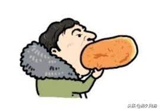
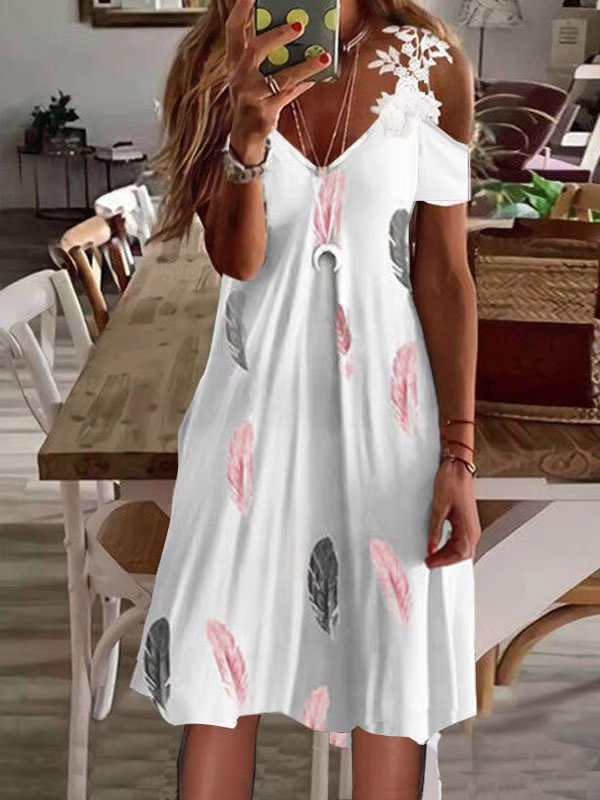
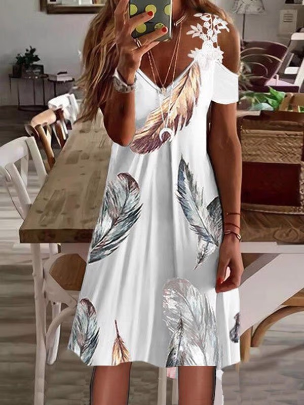
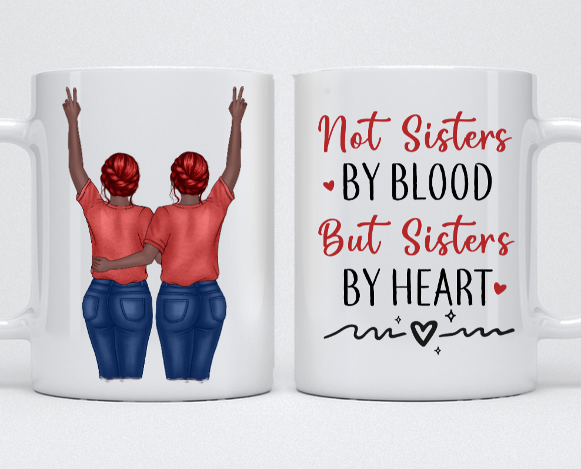

# Image Fuzzy Matching    

### 原理介绍 
此项目是对[imagehash](https://github.com/JohannesBuchner/imagehash)这个Python库的延展
原本项目是对两张图片进行对比, 然后给出一个数字结果, 数字越小说明两张图片越相似
但原库的对比方法输入是两张图片, 在实际项目中使用效率比较低

经过阅读源码, 我们们发现`imagehash`图片对比的基本流程是:
	1. 打开图片并通过算法转化成hash值
	2. 把hash值转化成numpy array
	3. 用numpy.count_nonzero()这个方法对两个numpy array进行对比得出结果

我们发现其实把图片通过`imagehash`转化为`numpy array`, 我们可以直接用`numpy.count_nonzero()`对两个`numpy array`进行对比也可以得到同样结果, 在实际项目中我们可以直接把这个`numpy array`可以转化成字符串并进行存储(字节长度小于100), 这样就可以提高使用效率, 具体方法在项目代码中

并且, 通过了解`numpy.count_nonzero()`这个方法的工作原理有可能实现**图片的模糊搜索**, 以后有空会做

### 代码讲解 
1. 把图片用`PIL.Image`打开
	```python
	image = Image.open(path1)
	```
2. 用本项目中的`fuzzy_match.image_2_string()`把图片转化成字符串, 这里的字符串就可以进行存储
    ```python
    image_string = fuzzy_match.image_2_string(image)
    ```
3. 需要对比时就把字符串用`fuzzy_match.string_2_npArray()`转化成`numpy array`
    ```python
    np_array1 = string_2_npArray(image_string)
    ```
4. 用两个`numpy array`对比得出一个数字结果, 数值越小两张图片越相似
    ```python
    result = image_fuzzy_match(np_array1, np_array2)
    ```

### 测试用例 
我们看下测试用例

##### Test case 1  
1 
2 

第二张图是第一张图微信截图截出来的, 第一张图少截了一周, 并且把右下角的一个log截掉了, 结果是3, 可以说明两张图是相似的

##### Test case 2   
1 
2 
这两张图除了裙子上的印花, 大小和其他都是一模一样的, 结果是4

##### Test case 3   
1 
2 
这张图的大小和人物颜色都不一样, 但是用的是同一个模板, 结果是10

##### Test case 4   
1 
2 
这组是拿第一组测试图片和第二组测试图片各一张图进行对比, 因为是完全不一样的图, 结果是41

结果可以看出来相似图片的对比数值基本在个位数左右